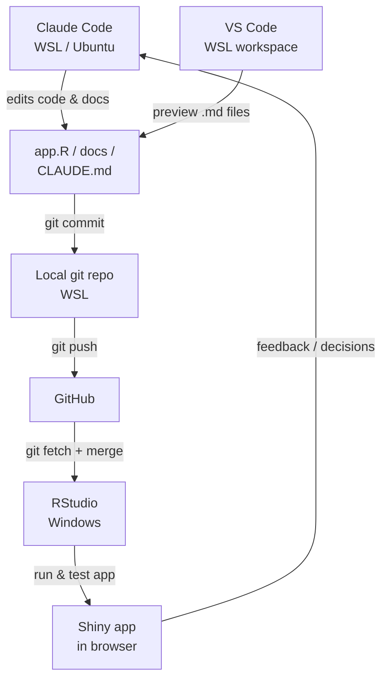

# Measles Outbreak Network Explorer — Project Brief for Claude

## What this is

An interactive R Shiny dashboard for visualising a measles outbreak as a network.
The primary users are **public health / outbreak investigation teams** who are not
technically trained. Everything must be explainable to a non-statistician.

The tool takes structured outbreak data (cases, contexts, visits) and produces
interactive network diagrams showing how cases and contexts are connected, alongside
an epidemic curve, network metrics, and editable epidemiological parameters.

This is currently a **working prototype under active development**. It is not yet
deployed for real use. Development is tracked via the in-app Dev Panel tab (to be
removed before release — task 7.4).

---

## Current development phase

Working through a 7-phase plan. Check the Dev Panel tab in the running app or
`dev_progress.json` for current status. Phases run roughly in order:

1. Data Model & Schema — define required fields, validation, data dictionary
2. Network Diagram Types — decide which views to keep, document their epi purpose
3. Data Collection Interface — manual entry forms, export
4. Definitions, Tooltips & Help — consistent, plain-language explanations throughout
5. Epi Parameters & Assumptions — validate defaults, add citations, input validation
6. UI & UX Polish — layout, accessibility, performance
7. Pre-Release — cleanup, final review, remove dev panel

---

## Repository structure

```
app.R                  # Single-file Shiny app — all UI and server code
dev_progress.json      # Dev panel task statuses and notes (auto-generated, gitignored candidate)
action_tracker.json    # Action tracker entries (auto-generated, gitignored candidate)
docs/decisions/        # Architecture Decision Records (ADRs) — create when needed
CLAUDE.md              # This file
```

The app is intentionally a single file (`app.R`) for now. Do not split into
`ui.R` / `server.R` or a module structure unless explicitly asked — it adds
navigation overhead during rapid prototyping.

---

## Data model

Four sheets (from `.xlsx` upload or demo data). Full field-level definitions are in `docs/data-dictionary.md`; ERD is in `docs/erd.svg`.

### cases — one row per case
| Field | Type | Required | Notes |
|---|---|---|---|
| `case_id` | character | yes | unique identifier; PK; format `C-nnn` (auto-generated in template) |
| `onset_date` | date | yes | drives time slider, epi curve, infectious-period logic |
| `age_group` | character | no | fixed bands: `Under 1 year`, `1–4 years`, `5–17 years`, `18–29 years`, `30–49 years`, `50+` |
| `gender` | character | no | `Male`, `Female`, `Other`, `Unknown`; available as an epi-curve grouping option |
| `vaccination_status` | character | no | `Unvaccinated`, `1 dose`, `2 doses`, `Unknown` |
| `case_status` | character | no | `Confirmed`, `Probable`, `Possible`; **displayed in the UI as "Case confidence"** (field name unchanged) |
| `likely_index_case` | character | no | `case_id` of the recorded source case (self-reference → cases); drives the "Who infected whom" view. One source per case. |

### contexts — one row per context
| Field | Type | Required | Notes |
|---|---|---|---|
| `context_id` | integer | yes | surrogate PK; join key throughout; format `Ctxt-nnn` (auto-generated in template) |
| `context_name` | character | yes | human-readable name |
| `context_type` | character | yes | user-defined categorical (not pre-coded) |

### case_contexts — one row per case × context combination
| Field | Type | Required | Notes |
|---|---|---|---|
| `case_id` | character | yes | PK + FK → cases |
| `context_id` | integer | yes | PK + FK → contexts |
| `visit_relevance` | character | derived | Not stored. Computed at runtime: `Infectious period`, `Exposure window`, `Both`, `Neither` |

### visit_dates — one row per epi-relevant visit date
| Field | Type | Required | Notes |
|---|---|---|---|
| `case_id` | character | yes | PK + FK → case_contexts |
| `context_id` | integer | yes | PK + FK → case_contexts |
| `visit_date` | date | yes | one row per calendar day |

---

## Network views

Three views selectable from a dropdown in the network card header:

| View | ID | Description |
|---|---|---|
| Contexts network | `"projection"` | Places linked by shared cases; edge weight = shared cases |
| Who visited where | `"bipartite"` | Cases × contexts; edges coloured by visit timing category (see ADR-002) |
| Who infected whom | `"contacts"` | Transmission links from the `likely_index_case` field on the cases sheet (view ID is still `"contacts"`) |

**Which views to keep is an open decision (Phase 2).** Do not add new views or
remove existing ones without being asked.

---

## Epidemiological parameters (measles defaults)

All editable live in the "Assumptions & parameters" tab:

| Parameter | Default | Meaning |
|---|---|---|
| `inc_min` | 7 days | Incubation period minimum (exposure → onset) |
| `inc_max` | 21 days | Incubation period maximum |
| `inf_before` | 4 days | Infectious period: days before onset |
| `inf_after` | 4 days | Infectious period: days after onset |

Transmission links in the Who infected whom view come from the `likely_index_case`
field on the cases sheet (the investigator's recorded source for each case) — they
are **not** derived from timing. The incubation/infectious parameters are used to
shade the timeline and as a reference when the investigator records each visit's
relevance category.

---

## R packages in use

| Package | Purpose |
|---|---|
| `shiny` | App framework |
| `bslib` | Bootstrap 5 UI components (cards, layout, tooltips) |
| `visNetwork` | Interactive network diagrams (wraps vis.js) |
| `igraph` | Network metric calculation (degree, betweenness) |
| `plotly` / `ggplot2` | Epidemic curve |
| `DT` | Interactive data tables |
| `dplyr`, `tidyr`, `purrr`, `tibble` | Data wrangling |
| `readxl` | Excel file import |
| `lubridate` | Date handling |
| `jsonlite` | Dev panel / action tracker JSON persistence |

---

## Conventions — always follow these

- **UI components:** use `bslib` cards (`card()`, `card_header()`, `card_body()`),
  `layout_columns()`, and `layout_sidebar()`. Do not use raw Bootstrap divs for
  layout unless bslib has no equivalent.
- **Tooltips:** use the `info()` helper (defined near the top of app.R) for all ⓘ
  icon tooltips. Use `hdr()` for card headers that need a tooltip.
- **Context colours:** use `colour_map(types)` to assign colours from `CONTEXT_PALETTE`. Do not hardcode hex colours for context types anywhere else. Context types are dynamic (user-defined), so colours must be assigned at runtime.
- **Reactive pattern:** keep data loading in `raw()`, filtering in `filtered()`,
  network building in `netdata()`. Do not add new top-level reactives for data
  that fits this chain.
- **Demo data:** the `make_demo_data()` function must always return valid data
  matching the current schema. Update it whenever the schema changes.
- **Single file:** all code stays in `app.R` until explicitly asked to split.
- **Dev panel code:** clearly marked with `# ---- Dev panel` and
  `# ---- Action tracker` section comments. Do not interleave with main app logic.

---

## Conventions — never do these without being asked

- Do not split `app.R` into modules or separate files
- Do not change the bslib theme (`flatly`) or Bootstrap version (5)
- Do not add new R package dependencies without flagging it
- Do not refactor working code as part of a bug fix or feature addition
- Do not add explanatory comments describing *what* code does — only *why* if the
  reason is non-obvious
- Do not change the `CONTEXT_PALETTE` colours or their order
- Do not alter the dev panel task list (DEV_TASKS) without being asked

---

## Git workflow

- Branch `main` is the stable baseline
- Feature work goes on named branches (e.g. `data-entry-forms`, `phase-2-views`)
- Commit after each logical unit of work with a clear message
- Push branches to GitHub; open a PR to merge into `main` when a phase is complete

## Development workflow



- All code and doc editing is done through Claude Code — not directly in RStudio or VS Code
- RStudio is used only to pull from GitHub and run/test the app
- VS Code is used only to preview `.md` files with formatting

## Project management

- **GitHub Issues** — task tracking, bugs, decisions to make. One issue per task.
- **Obsidian** — installed on Windows, vault points at `C:\Users\mgedmunds\projects\network-diagram`
- **`docs/` folder** — working notes and architecture decisions, lives in the repo so Claude can read it
  - `docs/data-model.md` — Phase 1 working notes, open questions, field decisions
  - `docs/data-dictionary.md` — full field-level reference for all tables
  - `docs/erd.svg` — schema diagram, auto-generated when the app starts
  - `docs/network-types.md` — Phase 2 working notes, view decisions
  - `docs/decisions/` — ADRs for significant decisions (use TEMPLATE.md)
- Windows Obsidian and WSL Claude Code stay in sync via `git pull` / `git push`
- Windows repo is at `C:\Users\claude-dev\projects\network-diagram`; RStudio pull sometimes needs `git fetch origin && git merge origin/main` in the Terminal tab if the remote cache is stale
- **Amendment log** — `docs/amendments.md` is where bugs and UI tweaks are queued between sessions. Add items there during app review (plain English, no special format). Claude reads it at session start alongside `docs/STATUS.md` and batches the fixes in one go.

---

## Key design principles

1. **Non-technical users first.** Every label, tooltip, and summary sentence must be
   understandable without a statistics background. Avoid jargon; when unavoidable,
   define it in the Definitions tab.
2. **Epidemiological correctness.** The tool is used during real outbreak
   investigations. Do not simplify in a way that could mislead an investigator.
3. **Parameters visible, not hidden.** The infectious and incubation period defaults
   are shown and editable. The logic behind derived links is documented. Nothing
   should happen silently.
4. **Prototype discipline.** Features are added one phase at a time. Do not jump
   ahead to Phase 3 work while Phase 1 is open.
