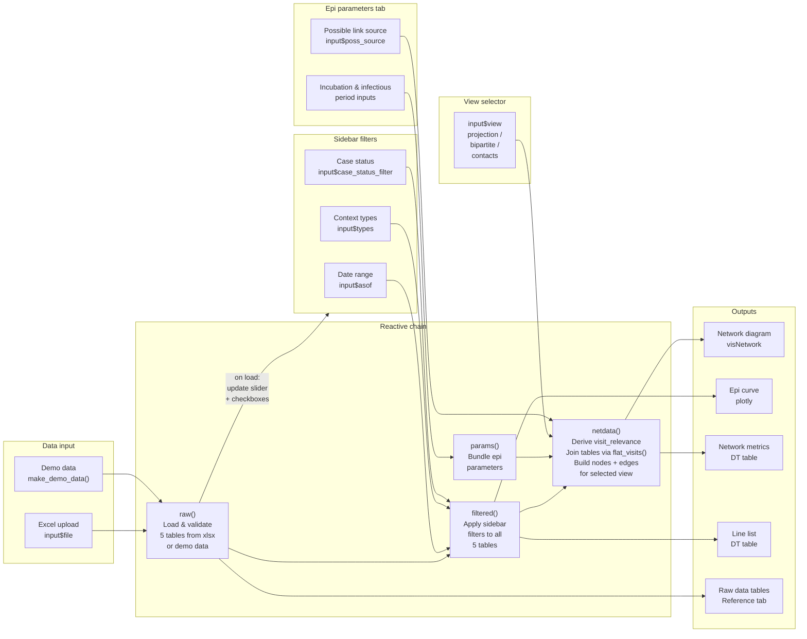

# Data Flow — Measles Outbreak Network Explorer

How data moves through the app: from input to reactive chain to outputs.
Update this diagram whenever the reactive chain changes.

---

## Reactive chain diagram

---

## Key functions in the chain

| Function | Location | Purpose |
|---|---|---|
| `make_demo_data()` | app.R ~line 184 | Generates synthetic 15-case outbreak; used when no file is uploaded |
| `flat_visits()` | app.R ~line 269 | Canonical join: case_contexts → contexts (name/type) → visit_dates |
| `derive_visit_relevance()` | app.R | Computes `visit_relevance` for each case×context using epi windows |
| `build_context_projection()` | app.R | Builds nodes/edges for the Contexts network view |
| `build_bipartite()` | app.R | Builds nodes/edges for the Who visited where view |
| `build_contacts_network()` | app.R | Builds nodes/edges for the Who infected whom view |
| `derive_possible_links()` | app.R | Derives possible transmission links from timing + shared context |
| `colour_map()` | app.R ~line 47 | Assigns colours from `CONTEXT_PALETTE` to context types at runtime |
| `network_metrics()` | app.R | Computes degree, betweenness etc. via igraph for the metrics table |

---

## Notes

- `visit_relevance` is derived inside `netdata()` on every parameter change — it is never stored in the data
- `filtered()` always returns all 5 tables as a list; downstream functions destructure as needed
- Sidebar filter controls are populated by `observeEvent(raw())` when data loads, so they always reflect the current dataset's actual values
- The contacts view has two modes: use the contacts sheet directly, or derive possible links from timing (`input$poss_source`)
