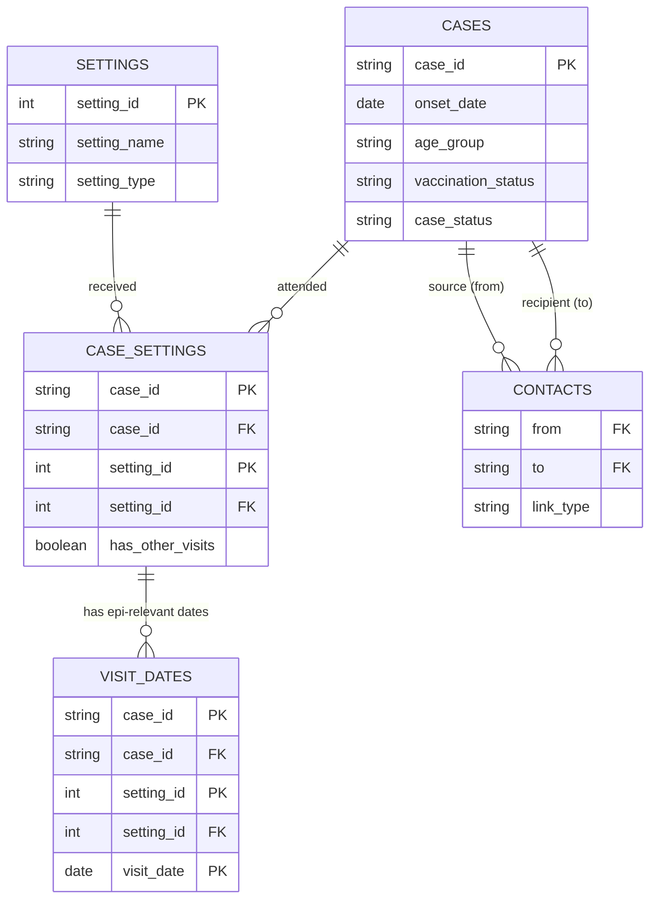

# Data Model — Working Notes

Phase 1 working document. Tracks decisions about what data the tool needs.

---

## Schema

Four tables. Each has a clearly defined grain and primary key.

---

### cases — one row per case

| Field | Key | Type | Required | Notes |
|---|---|---|---|---|
| `case_id` | PK | character | yes | Unique identifier; join key throughout |
| `onset_date` | | date | yes | Drives time slider, epi curve, and infectious-period derivations |
| `age_group` | | character | no | Fixed bands — see Decisions |
| `vaccination_status` | | character | no | `Unvaccinated`, `1 dose`, `2 doses`, `Unknown` |
| `case_status` | | character | no | `Confirmed`, `Probable`, `Possible` — definitions pending. Drives the Case confidence filter in the sidebar (default: Confirmed and Probable shown). |

---

### settings — one row per setting

| Field | Key | Type | Required | Notes |
|---|---|---|---|---|
| `setting_id` | PK | integer | yes | Surrogate primary key; join key in case_settings and visit_dates |
| `setting_name` | | character | yes | Human-readable name; should be unique within the dataset |
| `setting_type` | | character | yes | User-defined categorical — see Decisions |

> Provided as a dedicated `settings` sheet in the xlsx upload.

---

### case_settings — one row per case × setting combination

Bridging table between cases and settings.

| Field | Key | Type | Required | Notes |
|---|---|---|---|---|
| `case_id` | PK + FK | character | yes | FK → cases.case_id |
| `setting_id` | PK + FK | integer | yes | FK → settings.setting_id |
| `has_other_visits` | | logical | no | TRUE = case visited this setting on additional dates outside the epi window; no specific dates captured for those |

> Composite primary key: (`case_id`, `setting_id`). `setting_name` and `setting_type` are not stored here — they are joined from `settings` at runtime.

---

### visit_dates — one row per epidemiologically relevant visit date

Child table hanging off case_settings. Records only dates that fall within or near the infectious/exposure window.

| Field | Key | Type | Required | Notes |
|---|---|---|---|---|
| `case_id` | PK + FK | character | yes | FK → case_settings.case_id |
| `setting_id` | PK + FK | integer | yes | FK → case_settings.setting_id |
| `visit_date` | PK | date | yes | Date of the epi-relevant visit |

> Composite primary key: (`case_id`, `setting_id`, `visit_date`) — one case visits a setting at most once per calendar day.

> `epi_category` is **derived by the app at runtime**, not stored. For each visit_date the app compares it against `onset_date` using the current incubation and infectious period parameters and assigns one of: `Exposure window`, `Infectious period`, `Both`, `Neither`. This drives edge colours in the Who Visited Where view. If the user changes the parameters, categories update automatically with no data migration needed.

---

### contacts — one row per transmission link (optional)

| Field | Key | Type | Required | Notes |
|---|---|---|---|---|
| `from` | FK | character | yes | Source case; FK → cases.case_id |
| `to` | FK | character | yes | Recipient case; FK → cases.case_id |
| `link_type` | | character | yes | `Confirmed` or `Suspected` |

> (`from`, `to`) treated as unique per link. Optional sheet — if absent, case-to-case links can be derived from shared settings and timing.

---

## Relational diagram

**Relationship symbols**

| Symbol | Meaning |
|---|---|
| `\|\|` | Exactly one |
| `o{` | Zero or more |
| `PK` | Primary key (composite where multiple fields marked) |
| `FK` | Foreign key |

---

## Epi-category derivation logic

For each row in `visit_dates`, the app derives a category by comparing `visit_date` against `onset_date` using the current parameter values:

| Category | Condition | Epi meaning |
|---|---|---|
| **Exposure window** | `onset_date − inc_max` ≤ `visit_date` ≤ `onset_date − inc_min` | Case may have been infected at this setting on this date |
| **Infectious period** | `onset_date − inf_before` ≤ `visit_date` ≤ `onset_date + inf_after` | Case may have infected others at this setting on this date |
| **Both** | Case has at least one date in the exposure window AND at least one date in the infectious period at this setting | Setting is relevant in both directions — case may have been infected there and may have infected others there |
| **Neither** | Date outside all windows | Visit is recorded but not considered epi-relevant |

Where a case × setting pair has multiple visit dates, the app picks the highest-priority category (Both > Infectious > Exposure > Neither) for the network edge, and lists all individual dates in the hover tooltip.

Parameters (`inc_min`, `inc_max`, `inf_before`, `inf_after`) are set in the Assumptions & Parameters tab and applied live.

---

## xlsx upload format

Five sheets expected:

| Sheet | Grain | Required fields |
|---|---|---|
| `cases` | one row per case | `case_id`, `onset_date` |
| `settings` | one row per setting | `setting_id`, `setting_name`, `setting_type` |
| `case_settings` | one row per case × setting | `case_id`, `setting_id` |
| `visit_dates` | one row per epi-relevant date | `case_id`, `setting_id`, `visit_date` |
| `contacts` | one row per link (optional) | `from`, `to`, `link_type` |

---

## Data collection — options

The Shiny app receives a clean structured export from a separate data collection system. The broader outbreak linelist is managed independently and is not uploaded into this tool.

Requirements:
- Concurrent multi-user entry during an active outbreak
- Validation on entry: field types, required fields, FK integrity (case_id must exist before case_settings rows are added)
- `setting_type` enforced as a user-defined categorical dropdown; values accumulate as data is entered
- Batch addition: multiple visit_dates rows for one case-setting in a single step
- Export as .xlsx with the four named sheets above

### Option A — Google Sheets (with Apps Script)

| | |
|---|---|
| **Concurrency** | Native real-time co-editing |
| **Validation** | Cell dropdowns, conditional formatting, Apps Script for cross-sheet FK checks |
| **setting_type** | Dropdown from a lookup tab; new types added there |
| **Transfer** | Download as .xlsx → rename sheets to match expected names → upload |
| **Pros** | Zero infrastructure, zero cost, familiar, rapid to set up |
| **Cons** | Validation bypassable via paste; no audit trail; FK integrity needs scripting |

### Option B — REDCap

| | |
|---|---|
| **Concurrency** | Full multi-user with record locking and audit trail |
| **Validation** | Field-level enforcement; branching logic; repeating instruments handle multiple visit_dates naturally |
| **setting_type** | Dropdown with "add new" via field configuration |
| **Transfer** | CSV export with field mapping to match schema |
| **Pros** | Robust and auditable; widely used in NHS/public health; handles repeating data and FK logic cleanly |
| **Cons** | Requires institutional access; longer setup; may be over-engineered for a short single-outbreak |

### Option C — Microsoft Forms + Excel on SharePoint

| | |
|---|---|
| **Concurrency** | Forms handles concurrency; Excel on SharePoint has co-authoring |
| **Validation** | Forms enforces field types; limited relational validation |
| **setting_type** | Dropdown in Forms (list maintained separately) |
| **Transfer** | Download Excel from SharePoint → upload |
| **Pros** | Within Microsoft/NHS ecosystem; no extra accounts |
| **Cons** | Forms → Excel pipeline via Power Automate is fragile; FK integrity difficult to enforce |

### Option D — Data entry built into the Shiny app (Phase 3 scope)

| | |
|---|---|
| **Concurrency** | Possible with SQLite backend; concurrent writes need careful handling |
| **Validation** | Full control — all relational rules enforceable in R |
| **setting_type** | Dropdown built from values already in the database |
| **Transfer** | None — data already in the tool |
| **Pros** | Single interface; tightest possible validation; no export/import step |
| **Cons** | Most development effort; significantly expands Phase 3 scope |

### Decision questions

1. Is REDCap available in your organisation? *(If yes, likely the best fit)*
2. How many concurrent users during an outbreak? *(2–3 → Sheets fine; 10+ → REDCap or built-in)*
3. Is an audit trail required (governance / legal)?
4. Single outbreak or reused across multiple events? *(Reuse favours more investment)*

---

## Data transfer from external linelist

The broader linelist is not uploaded to this tool. A minimal extract is transferred manually or via export.

Minimum fields required from the external linelist:

| External field | Maps to | Notes |
|---|---|---|
| Case identifier | `cases.case_id` | Must match exactly — the join key for all tables |
| Symptom onset date | `cases.onset_date` | |
| Age group (or DOB to derive) | `cases.age_group` | Must map to the six standard bands |
| Vaccination status | `cases.vaccination_status` | Must map to the four standard values |

---

## Open questions

**Schema**
- [x] **`setting_id`** — implemented as integer surrogate PK on settings; used as FK in case_settings and visit_dates. setting_name and setting_type removed from case_settings.
- [x] **`case_status`** — added as optional character field on cases. Values: `Confirmed`, `Probable`, `Possible`.
- [ ] **`case_status` definitions** — write plain-language definitions for Confirmed, Probable, and Possible. Update the data dictionary description and the Definitions tab in the app.
- [ ] **`vaccination_status`** — keep measles-specific values or make generic for reuse across outbreaks?
- [ ] **"Neither" dates in visit_dates** — should dates outside all epi windows be recorded? Currently the table implies all rows are epi-relevant. If "Neither" dates are needed, consider adding an `epi_relevant` flag.

**Data collection**
- [ ] **Collection method** — choose from Options A–D; answer the four decision questions first.
- [ ] **External linelist transfer** — manual or automated? Are field names standardised in the external linelist?
- [ ] **Field naming conventions** — specify which fields are needed from the external linelist and what naming conventions are expected on import.

**Epi logic**
- [ ] **Practitioner override** — should investigators be able to manually override a derived epi_category? If so, add an `override_category` field to visit_dates.

**Documentation**
- [ ] Data flow diagram — external linelist → collection tool → Shiny app → network views
- [x] Data dictionary — created as `docs/data-dictionary.md`; also rendered as interactive tables in the Reference tab of the app.

---

## Decisions made

**`age_group` — fixed bands**
Six bands aligned with vaccination schedule, school settings, and UKHSA reporting practice: `<1 year`, `1–4 years`, `5–17 years`, `18–29 years`, `30–49 years`, `50+ years`.

**`setting_type` — user-defined categorical**
Not a pre-coded fixed list. Categories are defined by the data entered during an outbreak. The data collection form enforces consistency via a growing dropdown; new values can be added when a new setting type is encountered. Preserves flexibility across outbreak contexts while keeping the field categorical for network grouping and colour-coding.

**Four-table relational structure**
Schema split into: `cases`, `settings`, `case_settings` (bridging), `visit_dates` (child lookup). Separates setting identity from case-setting relationships and allows multiple epi-relevant dates per case × setting pair without denormalisation. A boolean `has_other_visits` on case_settings flags non-epi-relevant visits without recording their specific dates.

**Epi-category is derived, not stored**
Visit timing category (Exposure window, Infectious period, Both, Neither) is computed at runtime from `visit_date`, `onset_date`, and the current parameter values. Never persisted, so changing parameters requires no data migration.

**Multiple visit dates — edge aggregation in the bipartite view**
Where a case × setting pair has multiple visit dates, the network shows one edge per pair (not one per date) to keep the diagram readable. The edge is classified as `Both` if the case has any date in the exposure window AND any date in the infectious period at that setting — even if no single date falls in both simultaneously (e.g. a household resident present across weeks). Otherwise the edge takes the highest-priority single-date category: Infectious > Exposure > Neither. All individual dates are listed in the hover tooltip.

**`setting_id` — surrogate primary key for settings**
Settings are identified by an integer surrogate key (`setting_id`) rather than `setting_name`. This prevents join failures if two distinct venues share a name. `setting_name` and `setting_type` live only in the `settings` table and are joined at runtime; they are not duplicated in `case_settings` or `visit_dates`.

---

## Validation rules

- `case_id` must be unique in cases
- `onset_date` must be a valid date
- `setting_id` must be unique in settings
- All `case_id` values in case_settings must exist in cases
- All `setting_id` values in case_settings must exist in settings
- All (`case_id`, `setting_id`) pairs in visit_dates must exist in case_settings
- `from` and `to` in contacts must both exist in cases
- `inc_min` < `inc_max` (enforced in app parameters)

---

## Notes
